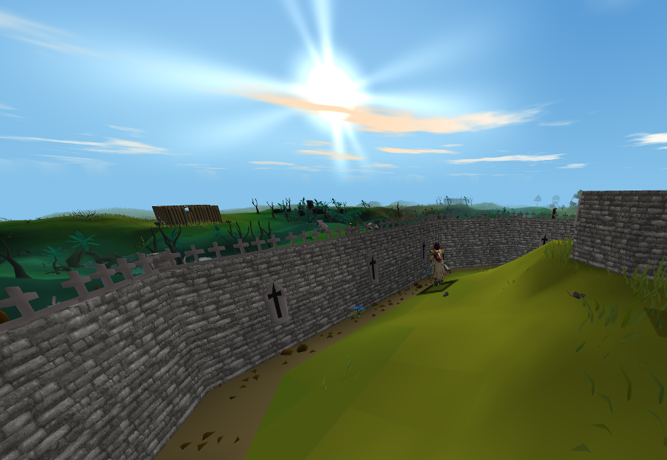
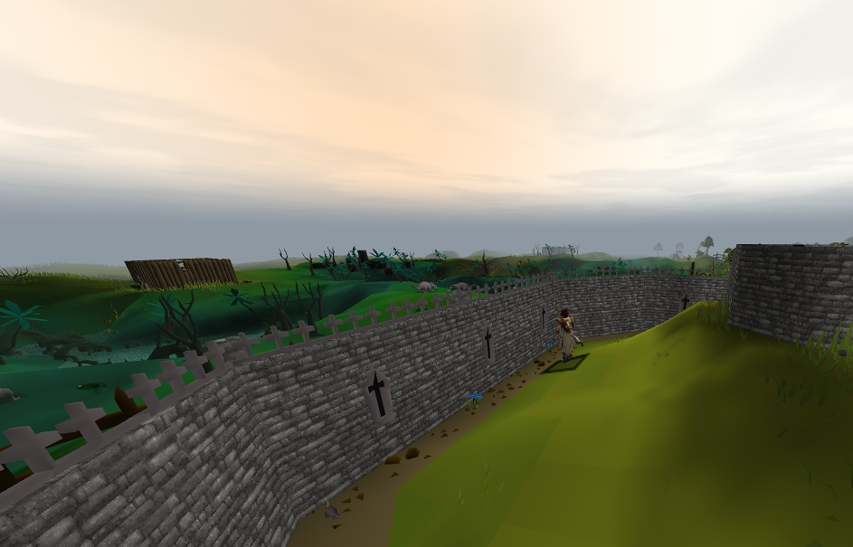
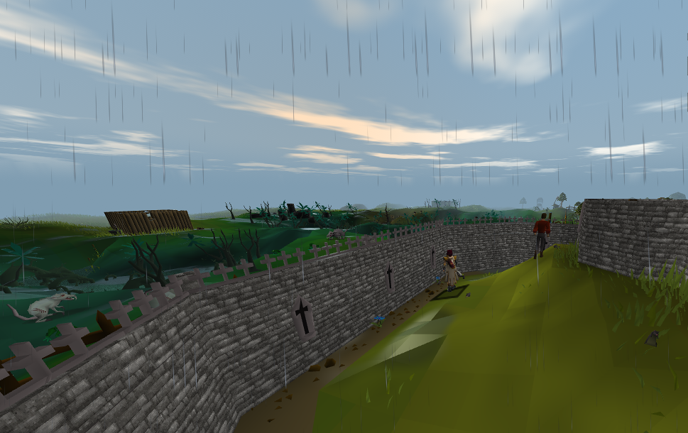
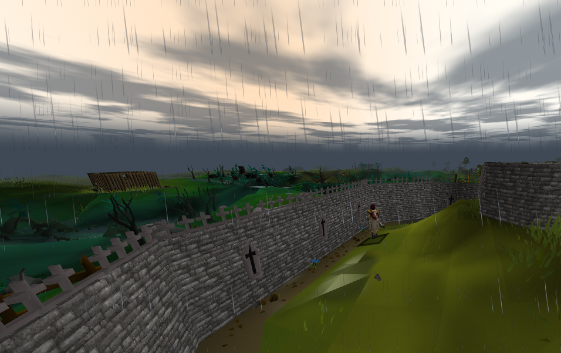
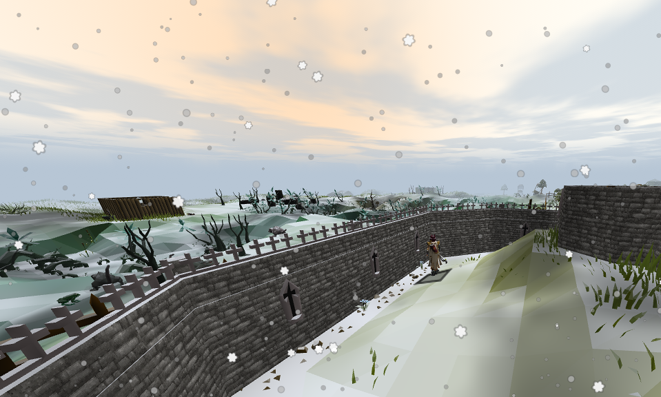
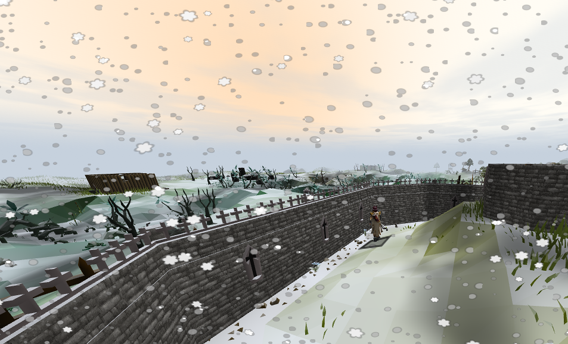
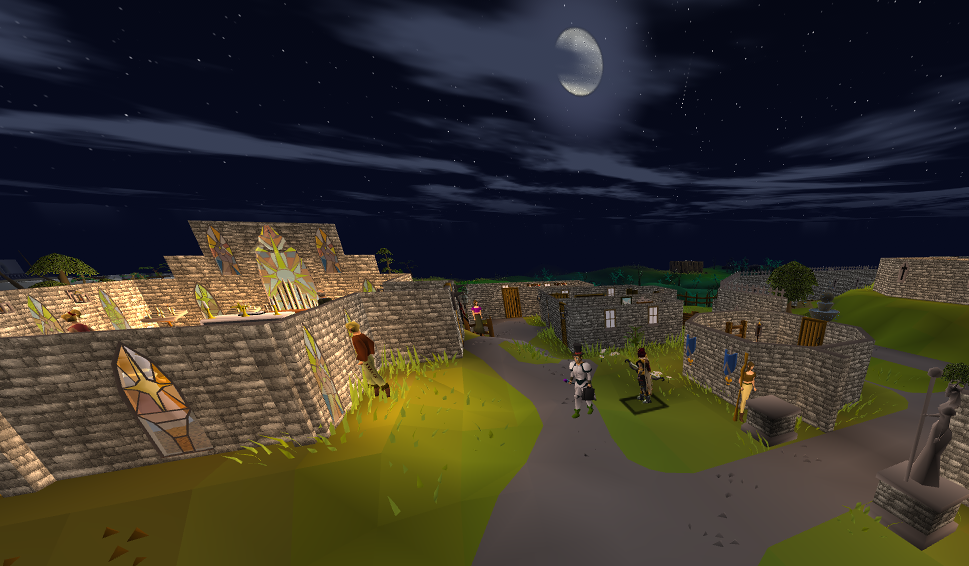
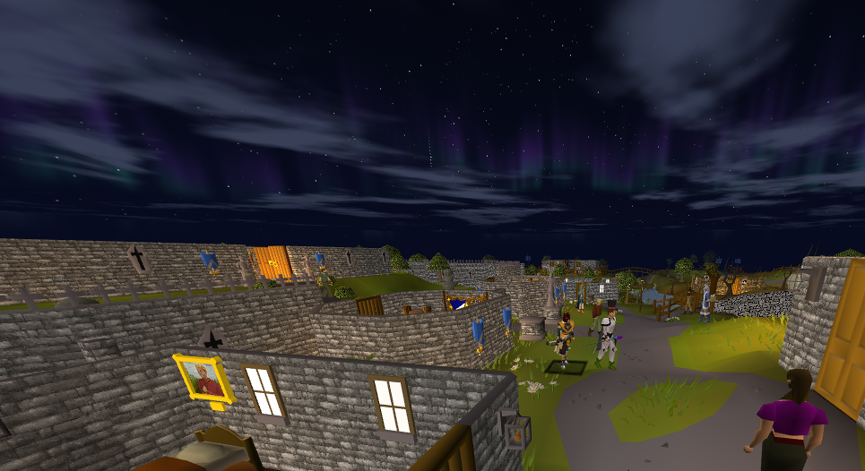
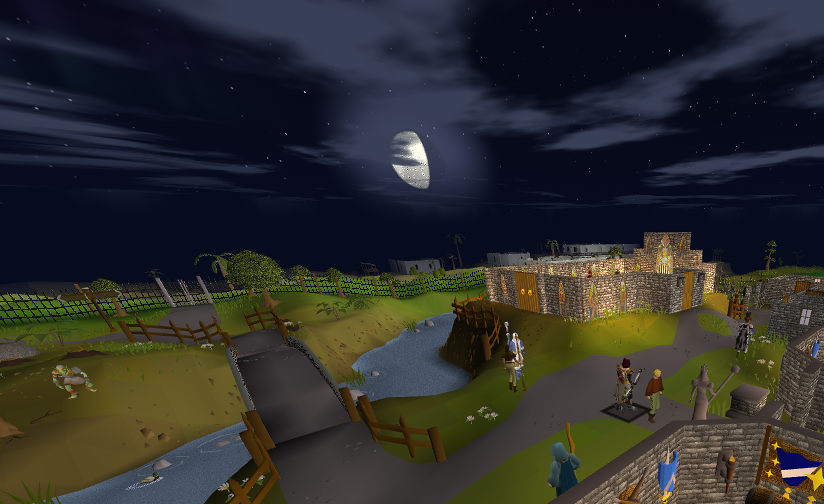
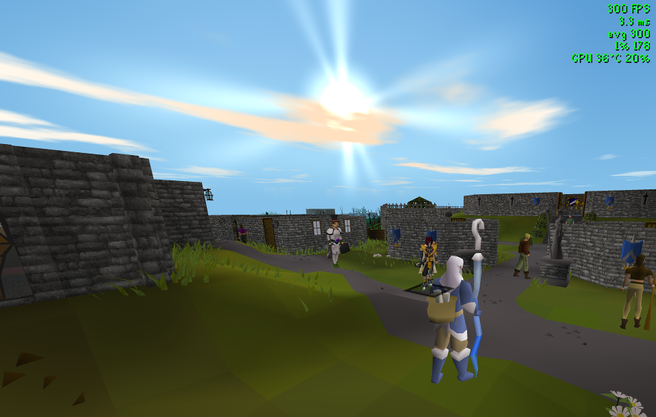

# GPU Sky/Weather (extension)

Sky, weather and lighting for RuneLite's GPU plugin — a day/night sky, rain, snow and
storms, dynamic lighting from fires and torches, and post-processing — built to stay
close to the original art rather than replace it.

It is an extension, not a renderer. The core **GPU** plugin draws the world; this hooks
into it through the GPU extension API and adds to what it draws, so it runs alongside
anything else built on the same API rather than replacing the renderer.

Everything is optional, and switching the plugin off hands the picture straight back to
the GPU plugin, so that is all it takes to compare the two.

## Requirements

- The core **GPU** plugin, enabled, in a RuneLite build that has the GPU extension API.
  At the time of writing that API is unreleased; see [PORTING.md](PORTING.md).
- Draw distance, anti-aliasing, frame rate and the other renderer settings are the GPU
  plugin's own, and are set in its panel.

The `master` branch holds the earlier form of this project, **GPU v2**: the same
features as a standalone fork of the renderer, which runs on the released client.

## Weather

Each condition settles the sky to match rather than falling out of a clear blue sky:
the cloud deck thickens, the sun goes, and the light on the ground dims with it. The six
shots below are the same spot at the same time of day.

| Sunny | Overcast |
|---|---|
|  |  |

| Rain | Storm |
|---|---|
|  |  |

| Snow | Blizzard |
|---|---|
|  |  |

Rain darkens the ground and pools puddles. Snow settles on the ground and on scenery as
it falls and melts once it stops. Storms bring lightning that flashes the world as well
as the sky, with thunder behind it if you want it.

Set to **Automatic**, the weather changes on its own over time, keeping clear skies
most of the time so that a storm arriving is still worth noticing. It follows the region
you are in: the desert stays dry, the mountains and the far north get snow where
elsewhere would get rain, Morytania is wet, and Karamja rains hard but
never snows.

## Sky and time of day

The sky runs a full day cycle from your system clock, shifting continuously through
dawn, midday, dusk and night rather than stepping between fixed states. The sun rises
in the east and sets in the west, matching the game's own compass, and its height
drives the sky colour, the direction of the lighting and the god rays.

A **Preview time** slider holds the sky at any minute of the day, so you can sweep
through a sunrise and watch the whole transition instead of waiting for one.

Underground, the sky blacks out and the weather stops — instantly on the way in, and
fading back as you climb out.

### At night

After dark there is a starfield, shooting stars, and an aurora low in the northern sky
on clear nights.

The moon waxes and wanes on its own cycle. The phase decides both where the moon sits
and how much light it throws, so a new moon leaves genuinely darker nights than a full
one.

## Dynamic lighting

Fires, torches, lanterns and braziers light the ground around them. Sources are found
automatically — by name, and by looking at the model for burning faces — so there is
no list of IDs to maintain and no setup.

Lights flicker on their own rhythms, fade in through dusk and out again at dawn, and
are always lit underground. Fire casts the colour you choose; a light that is plainly
something else, a blue flame or a green lantern, casts its own.

## Fog and lighting

Distance fog fades the far edge of the scene into the sky colour, which hides the hard
line where drawing stops. Ground mist pools in low ground and valleys, and aerial
perspective tints distant scenery with the colour of the air.

Over the top of the game's own shading sits a configurable ambient and directional
light. At night the moon takes over from the sun, as bright as its phase allows.

## Image and performance

Bloom, god rays, FXAA, sharpening and vignette run over the finished scene. Tone mapping
rolls off bright areas that would otherwise clip to flat white, and an optional auto
exposure lets the picture adjust between dark and bright places.

A performance overlay reports frame rate, frame time, 1% lows and — on NVIDIA cards —
GPU temperature and utilisation.

## Configuration

Every setting has a description explaining what it does; hover any of them in the
plugin panel. The sections are:

| Section | What is in it |
|---|---|
| **Display** | Tone mapping, FXAA, sharpening, vignette |
| **Performance** | Effect quality, post-processing switch, performance overlay |
| **Sky** | Preview time, underground sky |
| **Fog** | Distance fog, ground mist, aerial perspective |
| **Sun and moon** | The discs themselves, glare, moon phases |
| **Stars and aurora** | Starfield, shooting stars, aurora |
| **Clouds** | Cover, strength, drift speed, cloud shadows |
| **Weather** | Condition, regions, intensity, wind, ground effects, lightning, thunder |
| **Lighting** | Ambient, sun and moon light, dynamic lights, underground darkening |
| **Post-processing** | Bloom, god rays, colour grading, auto exposure |

## Credits

Built on RuneLite's GPU plugin and its extension API, which does the work of drawing the
world. What is added on top of it is this plugin's own.
